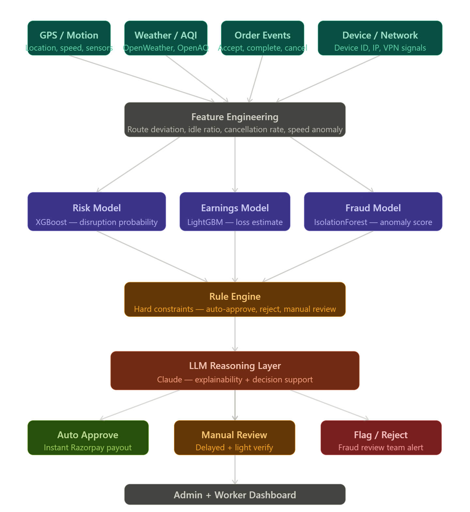

# 🛡️ Shielded Rider


### AI-Powered Monsoon Income Protection for Delivery Riders

---

##  Overview

**Shielded Rider** is a smart, automated parametric insurance system designed for two-wheeler delivery riders affected by monsoon disruptions.

Instead of manual claims and delayed payouts, our system:

- Predicts income loss
    
- Verifies real-world conditions
    
- Automatically compensates riders
    
---

## 🔐 Environment Variables & APIs

To run the application, you'll need to configure your environment variables. 
1. **Server (`server/.env`)**:
   - `OPENWEATHER_API_KEY`: Get a free key from OpenWeather for live weather risk scoring.
   - `RAZORPAY_KEY_ID` & `RAZORPAY_KEY_SECRET`: For simulating payouts (optional).
2. **ML Service (`ml-service/.env`)**:
   - `LLM_PROVIDER=openai`
   - `OPENAI_API_KEY`: Your ChatGPT API Key (Required for ML reasoning).

---

## 🏗️ How to Run via Docker

The platform is fully containerized using Docker Compose. Ensure you have **Docker Desktop** installed.

1. Clone the repository and navigate to the project directory.
2. Populate the `.env` files in `server/` and `ml-service/` as described above.
3. Run the following command from the root directory:

```bash
docker-compose up --build
```  

4. Access the services:
   - **Frontend App**: `http://localhost:5173`
   - **Backend Server**: `http://localhost:5000`
   - **ML Service**: `http://localhost:8001`
   - **MongoDB**: Bound to port `27017`

To run in the background, use `-d` flag. To stop the containers, run `docker-compose down`.


---

##  Problem

Delivery riders in Indian cities face:

- Heavy rainfall and flooding
    
- Unsafe road conditions
    
- Reduced order volume
    

This leads to **20–40% income loss**, while traditional insurance:

- Is slow
    
- Requires manual claims
    
- Doesn’t cover daily earnings
    

---

## Core Idea

- Predicts income disruption risk
- Tracks real-world conditions
- Estimates expected earnings
- Automatically compensates workers

 No claims. No paperwork. Fully automated.

### Key Innovation: Earnings Shadow Model

We don’t just detect rain — we calculate **actual income loss**.

**How it works:**

- Predict expected earnings
    
- Compare with actual earnings
    
- Trigger proportional payout
    

**Example:**

- Expected: ₹800
    
- Actual: ₹400
    
- Compensation: ₹400
    

---
### Why This Matters

- Moves beyond **event-based triggers → income-based protection**
- Introduces **real insurance logic (actuarial depth)**
- Personalized per worker

---

##  System Workflow

1. Rider subscribes to a weekly plan
    
2. System collects:
    
    - Location data
        
    - Delivery activity
        
    - Weather data
        
3. Risk model predicts disruption
    
4. Earnings model estimates expected income
    
5. Fraud engine validates claim
    
6. Payout is triggered automatically
    


---


##  AI/ML Architecture

### 1. Risk Prediction Model

- Model: XGBoost
    
- Predicts probability of disruption
    
- Inputs:
    
    - Rainfall
        
    - Flood data
        
    - Traffic conditions
        
**Output:**

```
P(disruption) ∈ [0,1]
```

### 2. Earnings Prediction Model

- Model: LigthGBM    
- Predicts expected daily income
    
- Inputs:
    
    - Historical earnings
        
    - Time & demand patterns
        
    - Weather
        

### 3. Fraud Detection Engine

- Model: Isolation Forest
    
- Detects anomalies and spoofing attempts
    

---

##  Anti-Fraud & Security System

### 🔹 Movement & Environmental Intelligence

- Matches rider movement with real traffic and weather conditions
    
- Detects unrealistic behavior
    

---

### 🔹 Cross-User Fraud Detection

- Identifies suspicious clusters of users with:
    
    - Same location
        
    - Same timestamps
        
    - Same inactivity
        

---

### 🔹 Active Movement Verification (Challenge-Response)

If GPS shows no movement during disruption:

- App prompts user to move ~100 meters
    
- Movement verified via:
    
    - Accelerometer
        
    - Gyroscope
        
    - GPS update
        

**If verified:** Claim proceeds  
**If not:**  
User is notified to check location services

 Prevents fake “idle but claiming loss” scenarios

---

### 🔹 Transparent Anomaly Resolution

Instead of silent rejection:

- System notifies users when anomalies are detected
    

**Example:**  
“Our system detected unusual device activity. Please reconnect or report the issue.”

**Benefits:**

- Builds trust
    
- Avoids unfair rejection
    
- Warns malicious users
    

---

##  Dynamic Pricing Model

### Income Stability Score (ISS)

Premiums are personalized based on:

- Order consistency
    
- Ratings
    
- Active hours
    
- Work patterns
    

**High ISS → Lower premium**  
**Low ISS → Adjusted premium**

Also considers:

- Local rainfall history
    
- Flood-prone zones
    
Risk Factor = (Local Rainfall History × Flood-Prone Zones)
```
ISS = (Avg Orders × Consistency × Rating × Active Hours × Risk Factor)
```

---

##  Policy Exclusions

No payouts in cases of:

- War or terrorism
    
- Government lockdowns
    
- Nuclear/biological events
    
- Proven fraud (GPS spoofing, tampering, account misuse)
    

---

##  Tech Stack

| Layer    | Technology                       |
| -------- | -------------------------------- |
| Frontend | React.js, Tailwind CSS, Vite     |
| Backend  | Node.js, Express                 |
| Database | MongoDB (Dockerized)             |
| ML Svc   | FastAPI, Scikit-learn, XGBoost   |
| LLM      | OpenAI (ChatGPT API)             |
| APIs     | OpenWeatherMap, OpenStreetMap    |
| Payments | Razorpay (Test Mode)             |

---

## 🚀 Features Implemented

- **Automated Weather Risk Scoring:** Integrates with OpenWeather to assess real-time risk.
- **Dynamic Payouts Simulation:** Connects mock payments using Razorpay's API.
- **LLM Reasoning Layer:** Employs OpenAI's GPT models via a dedicated ML service to analyze claims and behavioral anomalies.
- **Microservices Containerization:** The entire application (Frontend, Backend, ML Service, and MongoDB) is fully dockerized for isolated, one-click deployments.

---

##  Impact

- Protects gig workers’ daily income
    
- Reduces financial uncertainty
    
- Builds trust with transparent systems
    
- Enables scalable, automated insurance
    

---

##  Future Scope

- Deep learning for advanced fraud detection
    
- Direct integration with Swiggy/Zomato APIs
    
- Hyperlocal flood prediction (500m grid)
    

---

## Final Thought

RainShield Rider is not just an insurance system.

It is a **financial safety net engineered for real-world gig workers**, combining AI, behavioral analysis, and actuarial thinking to deliver **fair, fast, and fraud-resistant protection**.

